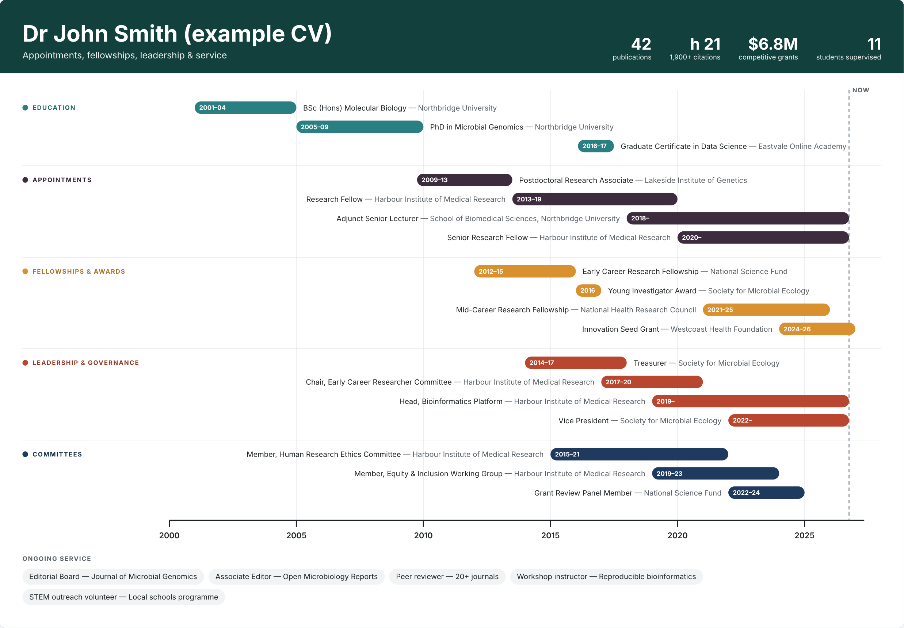

# CV Timeline

Turn a simple spreadsheet of your career into a timeline of concurrent roles: one lane per category, one bar per role, all on a shared time axis. It's useful for promotion applications, grant track-record sections, job talks and lab websites.



*The example data (`cv.tsv`) describes a fictional researcher, "Dr John Smith". All people, institutions and numbers in it are made up. Replace it with your own.*

**Live page:** https://agudeloromero.github.io/cv-timeline/ *(update this link if your username or repository name is different)*

- 📄 Works from a plain tab-separated (`.tsv`) file that you can edit in Excel or Google Sheets
- 🔒 Runs entirely in your browser. Uploaded files are never sent to a server.
- 🖼️ Exports to PNG (high resolution), SVG (editable vector) and PDF
- 🧰 No installation, build step or dependencies: it's a single `index.html`

---

## Contents

1. [Quick start](#quick-start)
2. [Publishing on GitHub Pages](#publishing-on-github-pages)
3. [Preparing your TSV file](#preparing-your-tsv-file)
4. [Using the page](#using-the-page)
5. [Keeping several versions](#keeping-several-versions)
6. [Troubleshooting](#troubleshooting)
7. [Repository contents](#repository-contents)

---

## Quick start

1. Open the live page.
2. Click **Download current TSV** to get the example file.
3. Open it in Excel or Google Sheets and replace the rows with your own roles.
4. Save it as **tab-separated** (see [Saving as TSV](#saving-as-tsv)).
5. Drag the file onto the page, or click **Upload TSV…**
6. Click **Save PNG**, **Save SVG** or **Print / PDF** to export your timeline.

Uploading a file only changes what *you* see in your browser. To change what everyone sees at the public link, update `cv.tsv` in the repository (below).

---

## Publishing on GitHub Pages

### First-time setup

1. Sign in to GitHub and click **New repository**. Name it, for example, `cv-timeline`.
2. In the new repository, click **Add file → Upload files** and drag in `index.html`, `cv.tsv`, `README.md` and `screenshot.png`. Click **Commit changes**.
3. Go to **Settings → Pages**.
4. Under **Build and deployment**, set **Source** to *Deploy from a branch*, choose branch **main** and folder **/ (root)**, then click **Save**.
5. Wait one or two minutes, then refresh the page. GitHub shows the address of your site: `https://<your-username>.github.io/<repository-name>/`.

### Updating your timeline

- **In the browser:** open `cv.tsv` in the repository, click the ✏️ pencil icon, make your changes and click **Commit changes**. If you edit on GitHub, keep the tabs between columns. It's usually easier to edit in a spreadsheet and re-upload.
- **By replacing the file:** click **Add file → Upload files**, drop in your new `cv.tsv` (keep exactly that name) and commit. It replaces the old one.

The live page updates within a minute or two. If you still see the old version, do a hard refresh (Ctrl + Shift + R on Windows, Cmd + Shift + R on Mac).

> **Privacy note:** in a public repository, anyone with the link can read `cv.tsv`. Only include what you would put on a public CV. You can still use the page privately: leave `cv.tsv` as a generic example and upload your real file locally each time.

---

## Preparing your TSV file

The first row must be the header. Column order doesn't matter, and column names are not case-sensitive.

| Column | Required | Description | Example |
|---|---|---|---|
| `category` | ✅ | The lane the row belongs to. Lanes appear in the order they first occur in the file. | `Appointments` |
| `label` | ✅ | The role, award or activity (dark text). | `Research Fellow` |
| `org` | | Organisation or detail, shown in grey after the label. | `Harbour Institute of Medical Research` |
| `start` | | Start date: `YYYY` or `YYYY-MM`. **Leave blank** to show the row as a chip in the strip under the timeline (for undated items). | `2018-02` |
| `end` | | End date: `YYYY`, `YYYY-MM` or `present`. Leave blank for a single-year item. | `present` |
| `color` | | Hex colour. On the first row of a lane it colours the whole lane; on later rows it colours just that bar. | `#2A7F82` |

### How dates are drawn

| `start` | `end` | Drawn as | Bar text |
|---|---|---|---|
| `2010` | `2014` | Jan 2010 → end of 2014 | `2010–14` |
| `2018-02` | `present` | Feb 2018 → today | `2018–` |
| `2023` | *(blank)* | the year 2023 | `2023` |
| *(blank)* | *(blank)* | a chip under the timeline | — |

`present`, `now`, `ongoing` and `current` all mean "up to today". A dashed **NOW** line marks today's date.

### Header rows

Special categories, starting with an underscore, fill the coloured banner instead of the timeline:

| `category` | `label` | `org` |
|---|---|---|
| `_title` | Main title in large bold text, usually your name | |
| `_subtitle` | Line under the title | |
| `_metric` | Big number, e.g. `50+` | Caption, e.g. `publications` |

You can add as many `_metric` rows as fit. Three to five works best.

### Example

```tsv
category	label	org	start	end	color
_title	Dr Jane Citizen
_subtitle	Appointments, fellowships & service
_metric	40+	publications
_metric	h 20	1,800+ citations
Education	PhD in Microbiology	University of Somewhere	2006	2010
Appointments	Postdoctoral Researcher	Institute A	2011	2015
Appointments	Senior Research Fellow	Institute B	2016-03	present
Fellowships & Awards	Early Career Fellowship	Funding Agency	2016	2019
Service	Editorial Board	Journal X
```

The columns must be separated by **tab** characters. If you copy this example, check that your editor keeps the tabs and doesn't turn them into spaces. A comma-separated `.csv` with the same columns also works.

Lines beginning with `#` are ignored, so you can hide a row by putting `#` at its start without deleting it.

### Saving as TSV

- **Excel:** *File → Save As →* choose **Text (Tab delimited) (\*.txt)**. The page accepts `.txt`, so you can rename it to `.tsv` or leave it.
- **Google Sheets:** *File → Download →* **Tab-separated values (.tsv)**.
- **LibreOffice Calc:** *File → Save As →* **Text CSV**, then set the field delimiter to `{Tab}`.
- **Mac Numbers:** *File → Export To → CSV*. The page reads CSV too.

---

## Using the page

| Control | What it does |
|---|---|
| **Upload TSV…** / drag-and-drop | Draws the timeline from your file. Nothing leaves your computer. |
| **Download current TSV** | Saves the data currently shown, as a starting template. |
| **Header colour** | Changes the banner colour. Pick it again after reloading, because it isn't saved. |
| **Save PNG** | Downloads a 2× resolution image, good for slides and documents. |
| **Save SVG** | Downloads a vector file that you can edit in Illustrator, Inkscape, Affinity or PowerPoint. |
| **Print / PDF** | Opens the print dialog in landscape. Choose *Save as PDF* to get a PDF. |

If a row can't be read (for example a date written as `Feb 2018`), the page skips it and lists the problem above the timeline. The rest still draws.

---

## Keeping several versions

You can keep more than one data file in the repository and choose between them with `?data=` in the address:

```
https://<your-username>.github.io/cv-timeline/                         → cv.tsv (default)
https://<your-username>.github.io/cv-timeline/?data=promotion.tsv      → promotion.tsv
https://<your-username>.github.io/cv-timeline/?data=grant-2027.tsv     → grant-2027.tsv
```

This lets you keep, for example, a short version for a job talk and a detailed one for a promotion panel.

---

## Troubleshooting

| Problem | Fix |
|---|---|
| *"Missing column category"* | The first row must be the header. Check it says `category` and `label`, and that the file is tab-separated rather than space-separated. |
| Everything appears in one lane, or nothing appears | The file was probably saved with commas or spaces in the wrong places. Re-save as tab-delimited. |
| A row is skipped | Dates must be `2018` or `2018-02`, and end dates can also be `present`. The message above the timeline gives the row number. |
| Accents or symbols look wrong (é, ñ, –) | Save the file as **UTF-8**. In Excel, choose *Unicode Text* or use Google Sheets. |
| A label overlaps a bar | Long labels are placed on whichever side of the bar has more room. Shorten the label or move detail into `org`. |
| The live site still shows old data | Wait a couple of minutes after committing, then hard refresh (Ctrl/Cmd + Shift + R). |
| Opening `index.html` by double-clicking shows no data | Browsers block a local page from reading `cv.tsv` directly. Use **Upload TSV…**, or view it through GitHub Pages. |

---

## Repository contents

| File | Purpose |
|---|---|
| `index.html` | The whole app: page, parser and timeline drawing |
| `cv.tsv` | The data shown when the page opens (fictional example) |
| `screenshot.png` | Image used in this README |
| `README.md` | This guide |

Built with plain HTML, CSS and JavaScript. Fonts come from [IBM Plex Sans](https://fonts.google.com/specimen/IBM+Plex+Sans) via Google Fonts.
