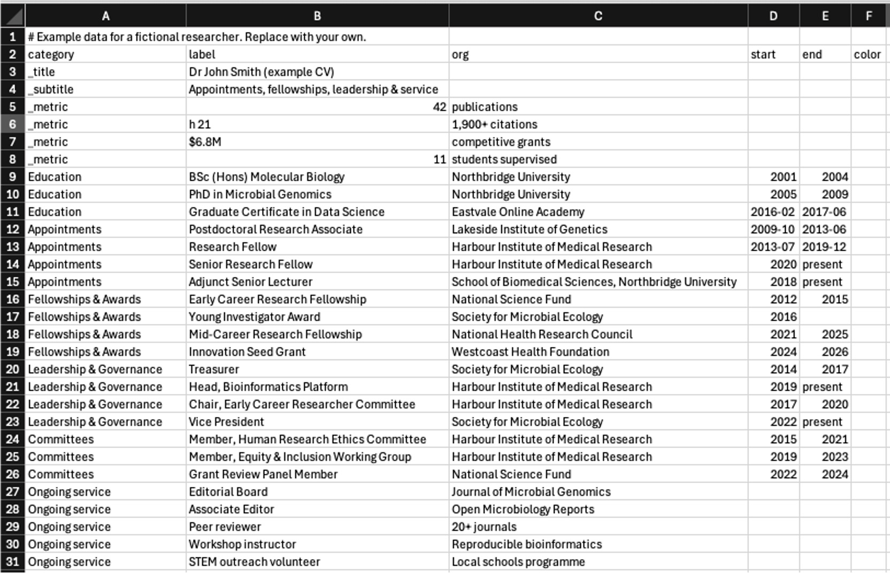

# CV Timeline

Turn a simple spreadsheet of your career into a timeline of concurrent roles: one lane per category, one bar per role, all on a shared time axis. It's useful for promotion applications, grant track-record sections, job talks and lab websites.


*The example data (`cv.tsv`) describes a fictional researcher, "Dr John Smith". All people, institutions and numbers in it are made up. Replace it with your own.*

🌟 **Try it: [live page](https://agudeloromero.github.io/cv-timeline/)**

- 📄 Works from a plain spreadsheet file (.tsv or .csv) that you can edit in Excel or Google Sheets
- 🔒 Runs entirely in your browser. Uploaded files are never sent to a server.
- 🖼️ Exports to PNG (high resolution), SVG (editable vector) and PDF
- 🧰 No installation, build step or dependencies: it's a single `index.html`

---

## Contents

1. [Quick start](#quick-start)
2. [Publishing on GitHub Pages](#publishing-on-github-pages)
3. [Preparing your TSV file](#preparing-your-tsv-file)
4. [Using the page](#using-the-page)
5. [Troubleshooting](#troubleshooting)
6. [Repository contents](#repository-contents)
7. [Questions & feedback](#questions--feedback)
8. [License](#license)

---

## Quick start

1. Open the [live page](https://agudeloromero.github.io/cv-timeline/).
2. Click **Download current TSV** to get the example file.
3. Open it in Excel or Google Sheets and replace the rows with your own roles.
4. Save it as **tab-separated** or **CSV UTF-8** (see [Saving as TSV](#saving-as-tsv)).
5. Drag the file onto the page, or click **Upload TSV…**
6. Click **Save PNG**, **Save SVG** or **Print / PDF** to export your timeline.

Uploading a file only changes what *you* see in your browser. To publish your own timeline with your data as the default, follow [Publishing on GitHub Pages](#publishing-on-github-pages).

---

## Publishing on GitHub Pages

To host your own copy:

1. Click **Fork** (top right of this repository) to copy it to your GitHub account.
2. In your fork, go to **Settings → Pages**.
3. Under **Build and deployment**, set **Source** to *Deploy from a branch*, choose branch **main** and folder **/ (root)**, then click **Save**.
4. After one or two minutes your site is live at `https://<your-username>.github.io/cv-timeline/`.

### Updating your timeline

- **In the browser:** open `cv.tsv` in your repository, click the ✏️ pencil icon, make your changes and click **Commit changes**. It's usually easier to edit in a spreadsheet and re-upload.
- **By replacing the file:** click **Add file → Upload files**, drop in your new `cv.tsv` (keep exactly that name) and commit.

The live page updates within a minute or two. If you still see the old version, do a hard refresh (Ctrl + Shift + R on Windows, Cmd + Shift + R on Mac).

> **Privacy note:** in a public repository, anyone can read `cv.tsv`. Only include what you would put on a public CV. Or keep the example as the default and upload your real file on the page each time, since it never leaves your browser.

---

## Preparing your TSV file

The first row must be the header. Column order doesn't matter, and column names are not case-sensitive.

| Column | Required | Description | Example |
|---|---|---|---|
| `category` | ✅ | The lane the row belongs to. Lanes appear in the order they first occur in the file. | `Appointments` |
| `label` | ✅ | The role, award or activity (dark text). | `Research Fellow` |
| `org` | | Organisation or detail, shown in grey after the label. | `Harbour Institute of Medical Research` |
| `start` | | Start date: `YYYY` or `YYYY-MM`. **Leave blank** to show the row as a chip in the strip under the timeline (for undated items). | `2018-02` |
| `end` | | End date: `YYYY`, `YYYY-MM` or `present`. Leave blank for a single-year item. | `present` |
| `color` | | Hex colour. On the first row of a lane it colours the whole lane; on later rows it colours just that bar. | `#2A7F82` |

### How dates are drawn

| `start` | `end` | Drawn as | Bar text |
|---|---|---|---|
| `2010` | `2014` | Jan 2010 → end of 2014 | `2010–14` |
| `2018-02` | `present` | Feb 2018 → today | `2018–` |
| `2023` | *(blank)* | the year 2023 | `2023` |
| *(blank)* | *(blank)* | a chip under the timeline | — |

`present`, `now`, `ongoing` and `current` all mean "up to today". A dashed **NOW** line marks today's date.

### Header rows

Special categories, starting with an underscore, fill the coloured banner instead of the timeline:

| `category` | `label` | `org` |
|---|---|---|
| `_title` | Main title in large bold text, usually your name | |
| `_subtitle` | Line under the title | |
| `_metric` | Big number, e.g. `50+` | Caption, e.g. `publications` |

You can add as many `_metric` rows as fit. Three to five works best.

### Adding your own categories

You aren't limited to the example categories. Any new name in the `category` column becomes its own lane:

| category | label | org | start | end |
|---|---|---|---|---|
| Teaching | Lecturer, Metagenomics unit | Northbridge University | 2019 | present |
| Grants | Project Grant (CI-A) | National Science Fund | 2021 | 2024 |
| Supervision | PhD student: A. Lee | Northbridge University | 2020 | 2024 |

- **Order:** lanes appear in the order each category first occurs in the file. Move rows in your spreadsheet to reorder them.
- **Spelling must match exactly.** "Grants" and "Grant" become two separate lanes.
- **Colours:** there are 7 built-in lane colours, which repeat from the 8th lane. To choose your own, add a hex code (e.g. `#5B6B2E`) in the `color` column of a lane's first row.
- **Dated or undated:** rows with a `start` date are drawn as bars on the timeline. Rows without one become chips under the timeline, grouped by category.
- **Size:** the page grows to fit. For slides, about 8 lanes or 40 bars is a comfortable maximum.

### Example

```tsv
category	label	org	start	end	color
_title	Dr Jane Citizen
_subtitle	Appointments, fellowships & service
_metric	40+	publications
_metric	h 20	1,800+ citations
Education	PhD in Microbiology	University of Somewhere	2006	2010
Appointments	Postdoctoral Researcher	Institute A	2011	2015
Appointments	Senior Research Fellow	Institute B	2016-03	present
Fellowships & Awards	Early Career Fellowship	Funding Agency	2016	2019
Service	Editorial Board	Journal X
```

The columns must be separated by **tab** characters. If you copy this example, check that your editor keeps the tabs and doesn't turn them into spaces. A comma-separated `.csv` with the same columns also works.

Lines beginning with `#` are ignored, so you can hide a row by putting `#` at its start without deleting it.

This is what the example `cv.tsv` looks like when opened in Excel:



### Saving as TSV

- **Excel:** *File → Save As →* choose **CSV UTF-8 (Comma delimited) (\*.csv)**. This keeps accents (é, ñ) and dashes intact. *Text (Tab delimited)* also works if your file has no accented characters.
- **Google Sheets:** *File → Download →* **Tab-separated values (.tsv)**.
- **LibreOffice Calc:** *File → Save As →* **Text CSV**, then set the field delimiter to `{Tab}`.
- **Mac Numbers:** *File → Export To → CSV*. The page reads CSV too.

---

## Using the page

| Control | What it does |
|---|---|
| **Upload TSV…** / drag-and-drop | Draws the timeline from your file. Nothing leaves your computer. |
| **Download current TSV** | Saves the data currently shown, as a starting template. |
| **Header colour** | Changes the banner colour. Pick it again after reloading, because it isn't saved. |
| **Save PNG** | Downloads a 2× resolution image, good for slides and documents. |
| **Save SVG** | Downloads a vector file that you can edit in Illustrator, Inkscape, Affinity or PowerPoint. |
| **Print / PDF** | Opens the print dialog in landscape. Choose *Save as PDF* to get a PDF. |

If a row can't be read (for example a date written as `Feb 2018`), the page skips it and lists the problem above the timeline. The rest still draws.

---

## Troubleshooting

| Problem | Fix |
|---|---|
| *"Missing column category"* | The first row must be the header. Check it says `category` and `label`, and that the file is tab-separated rather than space-separated. |
| Everything appears in one lane, or nothing appears | The file was probably saved with commas or spaces in the wrong places. Re-save as tab-delimited. |
| A row is skipped | Dates must be `2018` or `2018-02`, and end dates can also be `present`. The message above the timeline gives the row number. |
| Accents or symbols look wrong (é, ñ, –) | Save the file as **UTF-8**. In Excel, use *CSV UTF-8 (Comma delimited)*; Google Sheets downloads are already UTF-8. |
| A label overlaps a bar | Long labels are placed on whichever side of the bar has more room. Shorten the label or move detail into `org`. |
| The live site still shows old data | Wait a couple of minutes after committing, then hard refresh (Ctrl/Cmd + Shift + R). |
| Opening `index.html` by double-clicking shows no data | Browsers block a local page from reading `cv.tsv` directly. Use **Upload TSV…**, or view it through GitHub Pages. |

---

## Repository contents

| File | Purpose |
|---|---|
| `index.html` | The whole app: page, parser and timeline drawing |
| `cv.tsv` | The data shown when the page opens (fictional example) |
| `screenshot.png` | Timeline image used in this README |
| `cv.jpg` | Excel view of the example `cv.tsv`, used in this README |
| `LICENSE` | MIT licence |
| `README.md` | This guide |

---

## Questions & feedback

Have a question, found a bug, or have an idea to make this better? I'd be happy to hear from you.

- 💬 **Open an issue:** [github.com/agudeloromero/cv-timeline/issues](https://github.com/agudeloromero/cv-timeline/issues/new). This is best for bugs and feature requests, because others can see and join the discussion.
- ✉️ **Send me an email:** [p.agudeloromero@gmail.com](mailto:p.agudeloromero@gmail.com?subject=CV%20Timeline%20feedback)

Suggestions for improvement are always welcome. If this tool helped you, a ⭐ on the repository is much appreciated!

Built with plain HTML, CSS and JavaScript. Fonts come from [IBM Plex Sans](https://fonts.google.com/specimen/IBM+Plex+Sans) via Google Fonts.

---

## License

Released under the [MIT License](LICENSE). You're free to use, adapt and share it.

Copyright (c) 2026 Patricia Agudelo-Romero

